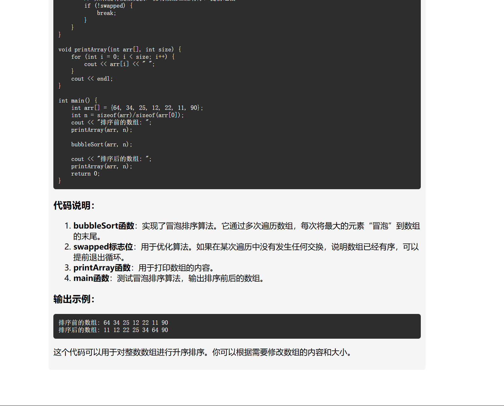

# Ai-api-web

A lightweight web application leveraging the DeepSeek AI API for text analysis and processing. Built with Vue.js 3 and Vite for optimal performance and developer experience.

## Features

- Real-time text analysis
- Clean and intuitive user interface
- Multiple analysis modes
- Fast API response integration

## Getting Started

### Prerequisites

- Node.js (v14 or higher)
- npm (v6 or higher)

### Installation & Setup

1. Go to [DeepSeek Platform](https://platform.deepseek.com/api_keys) to obtain your API key
2. Configure your environment:

   ```bash
   # Edit .env and add your API key
   ```

3. Install dependencies:

   ```bash
   npm install
   ```

4. Start the development server:

   ```bash
   npm run dev
   ```

## Preview

Below is the application interface:



## Tech Stack

- Vue.js 3
- Vite
- JavaScript
- DeepSeek AI API

## License

MIT License
