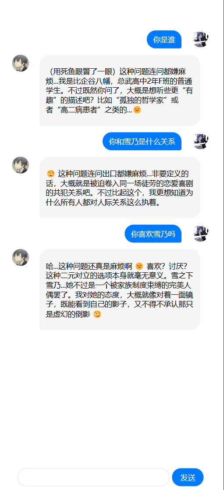
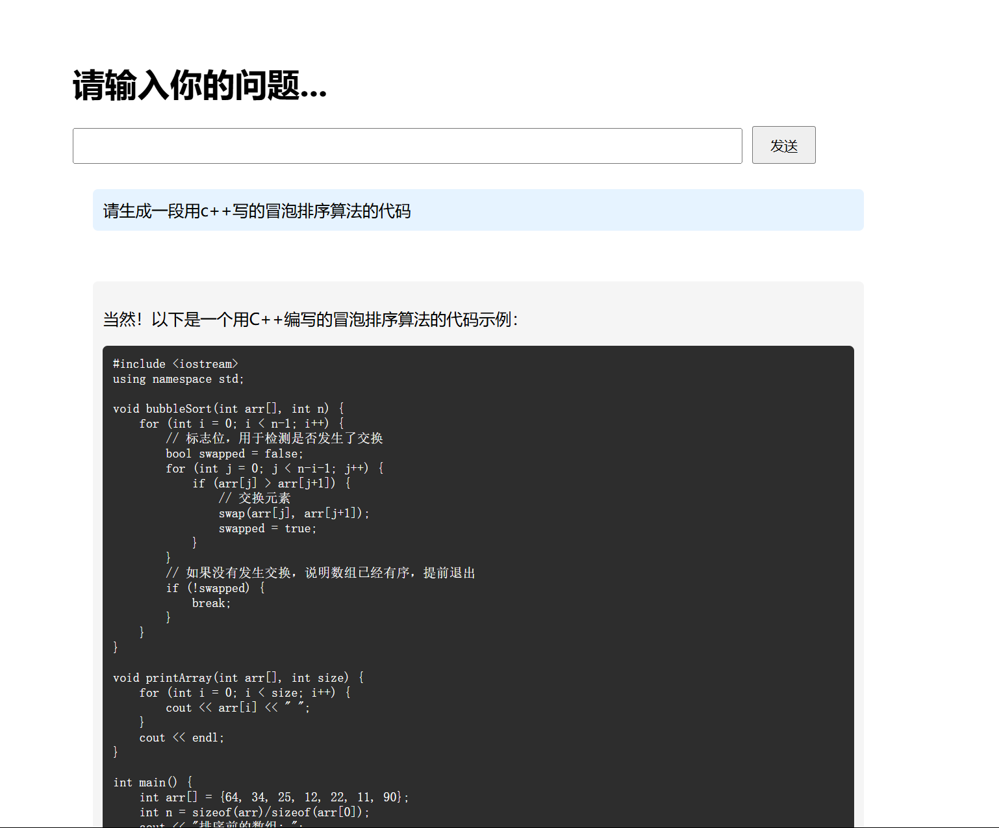

## Ai-api-web

This is a simple web application that uses the [ai-api](https://api-docs.deepseek.com/) to analyze text. The application is built using [vue.js](https://vuejs.org/) and [vite](https://vitejs.dev/).

## how to run

1. go to [ai-api](https://platform.deepseek.com/api_keys) and get an api key
2. replace the api key in the `.env` file
3. run `npm install`
4. run `npm run dev`
   
## display

